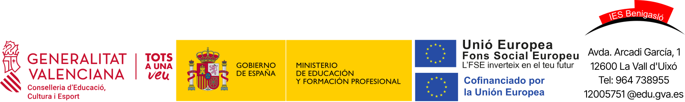

<div align="center">



</div>


# GUIA DOCENT

**IES Benigasló (La Vall d'Uixó)**

*Família Professional d'Informàtica i Comunicacions*

*Conselleria d'Educació, Cultura, Universitats i Ocupació — Generalitat Valenciana*


---

## 1. Dades Generals del Cicle i del Mòdul

| Concepte                      | Detall                                   |
| :---------------------------- | :--------------------------------------- |
| **Cicle Formatiu**            | Sistemes Microinformàtics i Xarxes (SMX) |
| **Grau**                      | Grau Mitjà                               |
| **Mòdul / Optativa**          | Introducció a la Programació             |
| **Curs Acadèmic**             | 2026 / 2027                              |
| **Curs**                      | 2n curs                                  |
| **Càrrega Horària**           | 3 hores setmanals                        |
| **Llenguatge de programació** | Python                                   |
| **Aula**                      | Aula d'informàtica                       |

---

## 2. Equip Docent i Canals de Comunicació

* **Professor/a:** Jaume Aragó Valls
* **Correu electrònic corporatiu:** `j.aragovalls@edu.gva.es`
* **Horari d'Atenció a l'Alumnat / Tutoria:** Dimarts 11:15 a 12:10

> **Nota Important de Comunicació:**
> Totes les notificacions i lliuraments es realitzaran exclusivament a través d'**Itaca**, d'**Aules** i del correu corporatiu oficial `@edu.gva.es`. No s'atendran comunicacions enviades des de comptes personals (Gmail, Hotmail, etc.).

---

## 3. Contextualització i objectius del mòdul

### 3.1. Introducció

L'optativa **Introducció a la Programació** té com a finalitat iniciar l'alumnat en els **fonaments de la programació i la resolució de problemes**, utilitzant **Python** com a llenguatge principal.

Al llarg del curs es treballarà de manera progressiva des de l'anàlisi d'un problema i el disseny d'algorismes fins al desenvolupament de programes senzills.

Es treballaran els **elements bàsics del llenguatge**, les **estructures de control**, les **funcions**, les **estructures de dades** i el **tractament de fitxers**, aplicant estos coneixements en activitats i programes cada vegada més complets.

L'objectiu principal no és memoritzar instruccions de Python, sinó desenvolupar la capacitat de **pensar, descompondre problemes, plantejar solucions i transformar-les en programes funcionals**.

### 3.2. Objectius generals

1. **Comprendre els principis bàsics de la programació**, identificant què és un programa, un llenguatge de programació i un algorisme.

2. **Analitzar problemes senzills**, identificant les dades d'entrada, el procés necessari i els resultats esperats.

3. **Desenvolupar programes bàsics amb Python**, utilitzant variables, tipus de dades, operadors, expressions i instruccions d'entrada i eixida.

4. **Utilitzar estructures de control**, aplicant condicionals i bucles per modificar el flux d'execució dels programes.

5. **Crear i utilitzar funcions**, dividint els problemes en parts més senzilles i organitzant el codi de manera modular.

6. **Treballar amb estructures de dades**, especialment cadenes, llistes i diccionaris, per gestionar conjunts d'informació.

7. **Llegir i escriure informació en fitxers**, permetent conservar i recuperar dades utilitzades pels programes.

8. **Desenvolupar autonomia en la resolució de problemes**, interpretant errors, realitzant proves, consultant documentació i millorant progressivament les solucions proposades.

---

## 4. Resultats d'Aprenentatge (RA) i continguts

L'assignatura **Introducció a la Programació** s'estructura en **sis Resultats d'Aprenentatge (RA)**, que permeten avançar progressivament des dels conceptes bàsics de programació fins al desenvolupament d'aplicacions senzilles amb Python.

### RA1. Introducció a la programació i resolució de problemes

* Comprendre què significa **programar** i què és un **llenguatge de programació**.
* Diferenciar entre **llenguatge natural i llenguatge de programació**.
* Conéixer de manera general l'evolució i els principals tipus de llenguatges.
* Comprendre els conceptes de **codi font, compilador i intèrpret**.
* Analitzar problemes identificant **entrada, procés i eixida**.
* Dissenyar **algorismes**.
* Representar solucions mitjançant **pseudocodi i diagrames de flux**.
* Aplicar la **descomposició de problemes** com a estratègia de resolució.

### RA2. Fonaments de programació amb Python

* Preparar l'entorn necessari per treballar amb **Python**.
* Crear i executar els primers programes.
* Utilitzar `print()` i `input()` per gestionar l'entrada i eixida d'informació.
* Declarar i utilitzar **variables**.
* Treballar amb els principals **tipus de dades**.
* Realitzar **conversions de tipus**.
* Construir expressions utilitzant **operadors aritmètics, relacionals i lògics**.
* Utilitzar comentaris i escriure codi clar i comprensible.

### RA3. Estructures de control

* Utilitzar estructures condicionals amb `if`, `elif` i `else`.
* Construir i combinar **condicions**.
* Utilitzar el bucle `while`.
* Utilitzar el bucle `for`.
* Generar seqüències mitjançant `range()`.
* Aplicar **comptadors i acumuladors**.
* Utilitzar estructures de control niades quan siga necessari.
* Resoldre problemes que requerisquen decisions i repeticions.

### RA4. Funcions i programació modular

* Comprendre la utilitat de les **funcions**.
* Definir i cridar funcions pròpies.
* Utilitzar **paràmetres i arguments**.
* Retornar resultats mitjançant `return`.
* Comprendre l'àmbit bàsic de les variables.
* Dividir problemes complexos en **funcions més senzilles**.
* Organitzar els programes aplicant principis bàsics de **programació modular**.

### RA5. Estructures de dades

* Treballar amb **cadenes de text**.
* Crear i utilitzar **llistes**.
* Accedir, modificar, afegir i eliminar elements.
* Recórrer estructures de dades mitjançant bucles.
* Realitzar cerques i operacions bàsiques sobre conjunts de dades.
* Crear i utilitzar **diccionaris**.
* Seleccionar l'estructura més adequada segons la informació que necessite gestionar el programa.

### RA6. Fitxers i desenvolupament d'aplicacions

* Comprendre la necessitat de **guardar informació de manera persistent**.
* Obrir i tancar fitxers des de Python.
* Llegir informació emmagatzemada en fitxers.
* Escriure i afegir informació.
* Treballar principalment amb **fitxers de text** i formats senzills d'intercanvi de dades.
* Gestionar de manera bàsica possibles **errors i excepcions**.
* Integrar variables, estructures de control, funcions, estructures de dades i fitxers.
* Desenvolupar una **aplicació final senzilla** que integre els coneixements treballats durant el curs.

---

> **En resum:** aprendrem a passar d'un **problema** a una **solució**, representar-la mitjançant un **algorisme** i transformar-la progressivament en un **programa funcional amb Python**.

### Planificació Temporal

| Bloc / Unitat | Descripció del Contingut                              |   Hores  | Trimestre         |
| :------------ | :---------------------------------------------------- | :------: | :---------------- |
| **UD 1**      | Introducció a la programació i resolució de problemes | **10 h** | 1r Trimestre      |
| **UD 2**      | Fonaments de programació amb Python                   | **15 h** | 1r Trimestre      |
| **UD 3**      | Estructures de control                                | **21 h** | 1r / 2n Trimestre |
| **UD 4**      | Funcions i programació modular                        | **15 h** | 2n Trimestre      |
| **UD 5**      | Estructures de dades                                  | **18 h** | 2n / 3r Trimestre |
| **UD 6**      | Fitxers i desenvolupament d'aplicacions               | **12 h** | 3r Trimestre      |
| **UD 7**      | Projecte final integrador                             |  **8 h** | 3r Trimestre      |
|               | **Total aproximat**                                   | **99 h** |                   |

---

## 5. Metodologia Didàctica

L'aprenentatge de la programació serà eminentment pràctic i basat en el principi de *Learning by Doing*:

1. **Classes Teoricopràctiques:** breus explicacions dels conceptes necessaris, acompanyades d'exemples i demostracions de codi en directe (*Live Coding*).

2. **Reptes i Tallers d'Aula:** resolució d'exercicis curts, problemes i reptes de dificultat progressiva, de manera individual o en parelles.

3. **Aprenentatge Basat en Projectes (ABP):** desenvolupament de programes i activitats pràctiques que integren progressivament els continguts treballats.

4. **Resolució de Problemes:** abans de programar, s'identificaran les dades d'entrada, el procés i l'eixida, dissenyant quan siga necessari l'algorisme corresponent.

La metodologia evolucionarà progressivament des d'activitats **més guiades** al principi del curs fins a activitats amb **major autonomia**.

L'ús d'Internet i d'eines d'**Intel·ligència Artificial** estarà permés quan forme part de l'activitat, però l'alumnat haurà de ser capaç de **comprendre, explicar i modificar les solucions que presente**.

---

## 6. Criteris d'Avaluació i Qualificació

L'avaluació és contínua, formativa i integradora. Cada Resultat d'Aprenentatge (RA) té associades activitats i proves que permeten valorar el grau d'assoliment dels continguts i competències treballats.

### 6.1. Ponderació General per Trimestre

```text
┌──────────────────────────────────────────────────────────────────────────┐
│                         DISTRIBUCIÓ DE LA NOTA                           │
├──────────────────────────────────┬───────────────────────────────────────┤
│ Activitats i Pràctiques          │ 30% (Reptes, activitats i programes)  │
│ Proves Individuals               │ 70% (Proves teòriques/pràctiques)     │
└──────────────────────────────────┴───────────────────────────────────────┘
```

### 6.2. Condicions de Superació del Mòdul

* Hi ha **dues convocatòries** per curs escolar.

* **Nota mínima en proves individuals:** per a fer mitjana amb la resta d'apartats, cal obtindre una qualificació mínima de **5,0 sobre 10** en les proves individuals.

* **Lliurament de pràctiques:** és obligatori haver lliurat almenys el **80% de les pràctiques obligatòries** proposades a *Aules* dins del termini establit.

* **Superació dels RA:** cada Resultat d'Aprenentatge haurà d'assolir-se amb una nota mínima ponderada de **5,0**.

* **Còpia i plagi:** l'ús de codi d'altres companys o de contingut generat mitjançant Intel·ligència Artificial sense autorització, sense comprendre'l o sense poder explicar-lo podrà comportar una qualificació de **0** en l'activitat corresponent.

### 6.3. Recuperacions

* Al final de cada trimestre es realitzarà una sessió de recuperació dels RA no assolits.

* A final de curs es disposarà d'una **Convocatòria Extraordinària Final** per recuperar aquells RA que continuen pendents.

---

## 7. Eines i Recursos de Treball

Totes les eines utilitzades a classe seran preferentment gratuïtes, de codi obert i multiplataforma:

* **Sistemes Operatius:** GNU/Linux (Ubuntu / Debian / LliureX).

* **Llenguatge de programació:** Python 3.

* **Entorn de desenvolupament:** Visual Studio Code o equivalent.

* **Representació d'algorismes:** diagrams.net, Excalidraw o eines equivalents.

* **Creació de continguts visuals:** Canva, Genially o eines equivalents quan l'activitat ho requerisca.

* **Plataforma d'Aprenentatge Virtual:** Aules.

* **Apunts i recursos de classe:** GitHub Pages.

* **Intel·ligència Artificial:** eines generatives com a suport per a la consulta, investigació, revisió i resolució de dubtes quan estiga autoritzat el seu ús.

---

## 8. Normes de Convivència

Per a garantir un entorn òptim de treball a l'aula d'informàtica:

1. **Begudes i Menjar:** prohibit introduir begudes o aliments a les taules dels equips informàtics.

2. **Manteniment:** respectar la configuració del maquinari i del programari dels equips. En finalitzar la sessió, el lloc de treball haurà de quedar correctament ordenat.

3. **Còpies de Seguretat:** l'alumnat és responsable de conservar còpies dels seus programes, activitats i projectes.

4. **Puntualitat:** l'entrada a l'aula s'efectuarà puntualment per no interrompre la dinàmica de treball.

5. **Mòbils:** només es podran utilitzar quan el professor n'autoritze l'ús com a part d'una activitat educativa.

---
