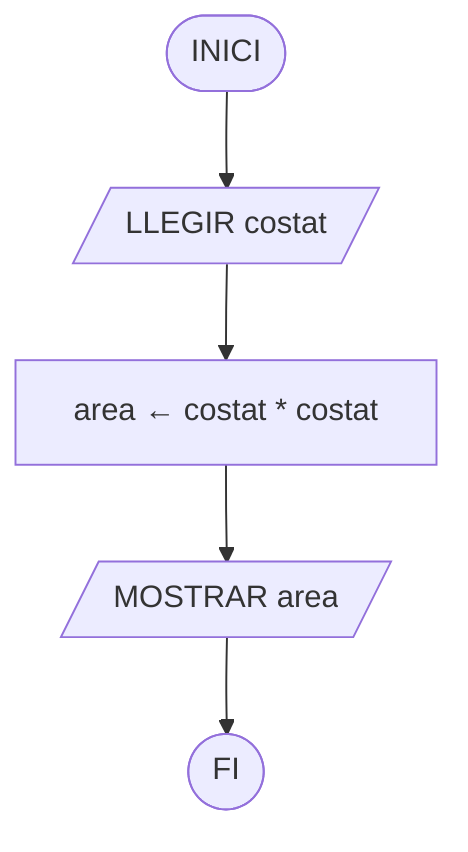
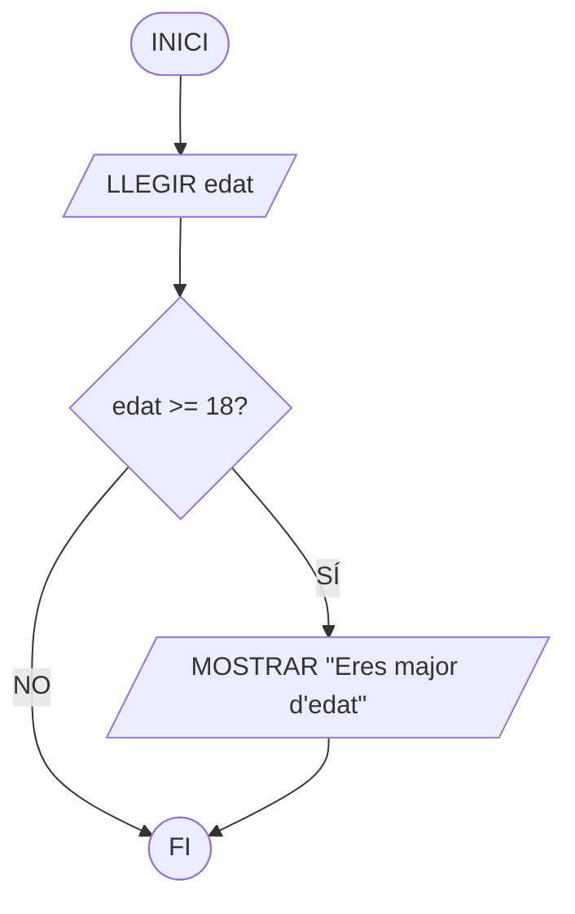
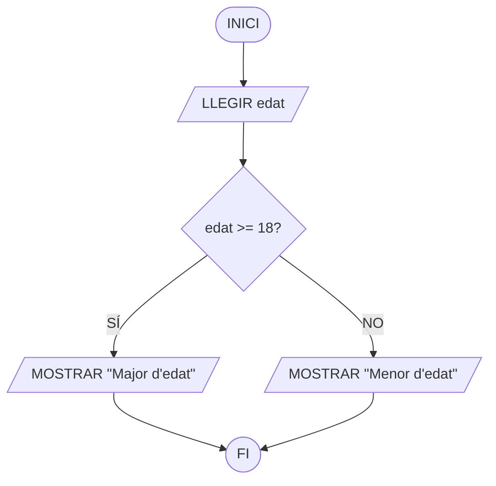
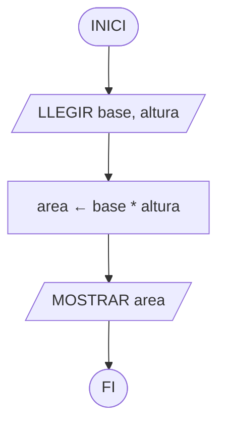
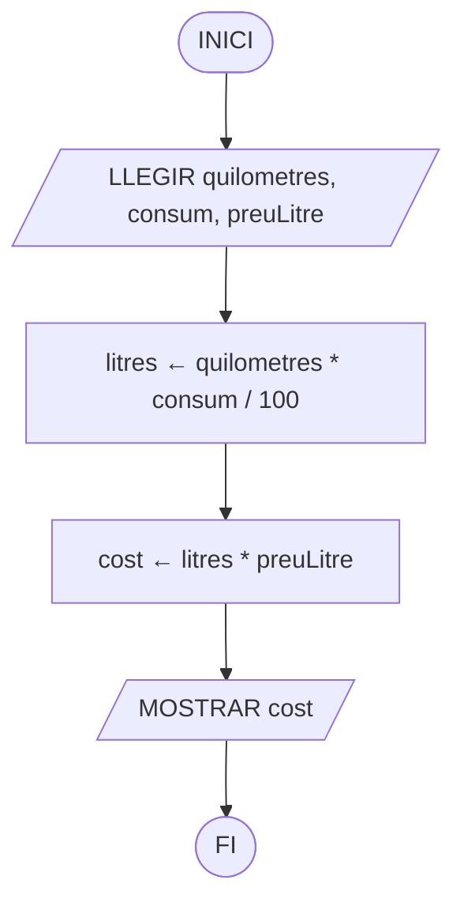
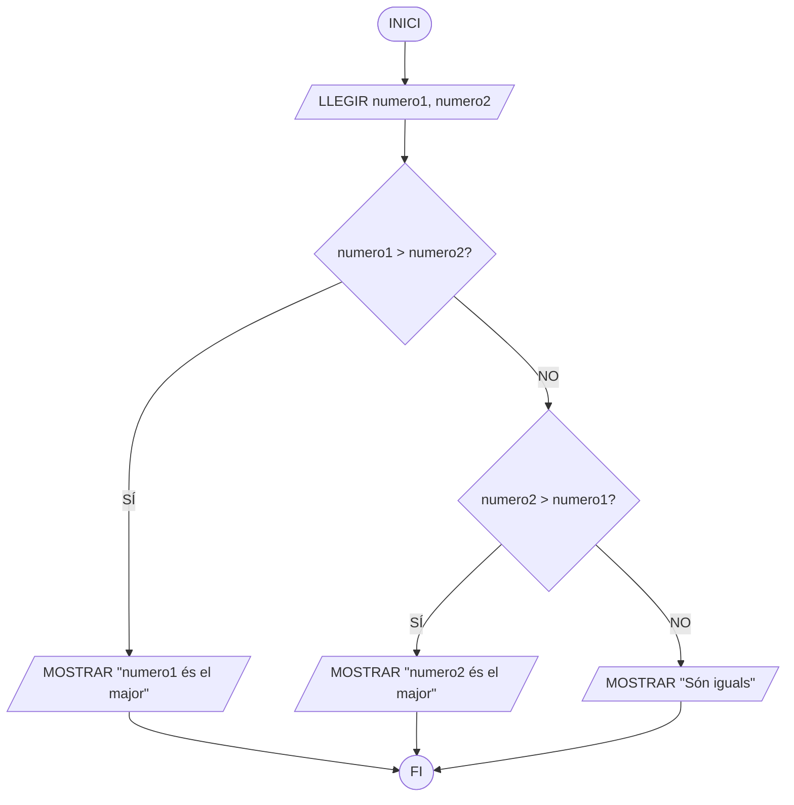

# Pseudocodi i diagrames de flux

Abans de començar a programar és important aprendre a **pensar la solució**.

Quan tenim un problema, podem seguir aquest procés:

```text
PROBLEMA
   ↓
ANALITZAR
   ↓
CREAR L'ALGORISME
   ↓
ESCRIURE EL PSEUDOCODI
   ↓
FER EL DIAGRAMA DE FLUX
   ↓
PROGRAMAR
```

El **pseudocodi** i els **diagrames de flux** són dues formes diferents de representar el mateix algorisme.

Els exercicis que treballarem necessiten començar amb problemes seqüencials d'entrada, càlcul i eixida, però després incorporen decisions simples i dobles, comparacions entre diversos valors i problemes amb diverses condicions.  

# 1. Pseudocodi

El **pseudocodi** és una manera d'escriure un algorisme utilitzant instruccions senzilles i fàcils d'entendre.

S'assembla a un programa, però **no és un llenguatge de programació** i, per tant, no es pot executar directament.

Per exemple:

```text
INICI

    LLEGIR preu
    descompte ← preu * 20 / 100
    preuFinal ← preu - descompte
    MOSTRAR preuFinal

FI
```

La idea és solucionar primer el problema sense preocupar-nos encara per la sintaxi de Python.

## Estructura bàsica

Un pseudocodi senzill tindrà normalment aquesta estructura:

```text
INICI

    LLEGIR dades

    REALITZAR operacions

    MOSTRAR resultats

FI
```

És el mateix esquema que ja coneixem:

```text
ENTRADA → PROCÉS → EIXIDA
```

## Entrada de dades: LLEGIR

Utilitzem `LLEGIR` quan necessitem obtindre una dada de l'usuari.

```text
LLEGIR edat
LLEGIR preu
LLEGIR nota1
LLEGIR nota2
```

La dada queda guardada en una **variable** perquè puguem utilitzar-la després.

Per exemple:

```text
LLEGIR costat
```

significa:

> Demana un valor a l'usuari i guarda'l en la variable `costat`.

## Guardar valors i fer càlculs

Utilitzarem la fletxa `←` per indicar que guardem un valor en una variable.

```text
area ← costat * costat
```

Primer es calcula:

```text
costat * costat
```

i el resultat es guarda en:

```text
area
```

Podem encadenar diverses operacions:

```text
LLEGIR anys

dies ← anys * 365
hores ← dies * 24

MOSTRAR hores
```

Els materials de la unitat utilitzen precisament aquesta idea: les variables emmagatzemen informació i les instruccions de procés realitzen operacions sobre elles. 

## Operacions

Les operacions que necessitarem són:

| Tipus        | Operadors              | Exemple                     |
| ------------ | ---------------------- | --------------------------- |
| Aritmètiques | `+  -  *  /  %`        | `resta ← a - b`             |
| Comparació   | `<  <=  >  >=  ==  !=` | `edat >= 18`                |
| Lògiques     | `AND  OR  NOT`         | `edat >= 18 AND edat <= 65` |

L'operador `%` calcula el **residu d'una divisió**.

Per exemple:

```text
residu ← 17 % 5
```

El resultat serà `2`.

Les comparacions i operacions lògiques seran especialment útils quan introduïm decisions. El material base també diferencia operacions aritmètiques, relacionals i lògiques. 

## Eixida de dades: MOSTRAR

Utilitzem `MOSTRAR` quan volem presentar informació a l'usuari.

```text
MOSTRAR area
```

També podem mostrar text:

```text
MOSTRAR "Hola"
```

o combinar text i variables:

```text
MOSTRAR "El resultat és: ", resultat
```

L'entrada i l'eixida són les que permeten que l'usuari interactue amb el programa: introduïm informació, el programa la processa i finalment mostra un resultat. 

# 2. Prendre decisions

No tots els programes executen sempre exactament les mateixes instruccions.

De vegades necessitem prendre una decisió:

```text
Si l'edat és 18 o més
    → mostrar "Major d'edat"
```

Per fer-ho utilitzem una **condició**.

```text
edat >= 18
```

Una condició només pot tindre dos resultats:

```text
CERT
FALS
```

Les estructures de control permeten modificar l'ordre normal d'execució d'un algorisme segons aquestes condicions. 

## SI — Decisió simple

Utilitzem una decisió simple quan volem executar una acció **només si es compleix una condició**.

```text
SI condició LLAVORS
    instruccions
FI_SI
```

Per exemple:

```text
LLEGIR edat

SI edat >= 18 LLAVORS
    MOSTRAR "Eres major d'edat"
FI_SI
```

Si l'edat és menor de 18, no es mostra res i el programa continua.

Aquesta és l'estructura alternativa simple descrita als materials de la unitat. 

## SI / SINO — Decisió doble

Quan volem fer una cosa si la condició és certa i una altra si és falsa:

```text
SI condició LLAVORS

    instruccions

SINO

    altres instruccions

FI_SI
```

Per exemple:

```text
LLEGIR edat

SI edat >= 18 LLAVORS
    MOSTRAR "Eres major d'edat"
SINO
    MOSTRAR "Eres menor d'edat"
FI_SI
```

En aquest cas **sempre s'executarà un dels dos camins**. 

## Diverses decisions

També podem necessitar comprovar més d'una condició.

Per exemple:

```text
LLEGIR nota

SI nota < 5 LLAVORS
    MOSTRAR "Suspés"
SINO
    SI nota < 7 LLAVORS
        MOSTRAR "Aprovat"
    SINO
        MOSTRAR "Notable o superior"
    FI_SI
FI_SI
```

Açò ens permet resoldre problemes amb **diversos casos possibles**, com convertir una nota numèrica en una qualificació o comparar diversos números, que apareixen en els exercicis de nivell avançat. 

# 3. Diagrames de flux

Un **diagrama de flux** o **ordinograma** és la representació gràfica d'un algorisme.

En lloc d'escriure únicament instruccions, utilitzem **formes i fletxes** per mostrar visualment l'ordre d'execució.

Són especialment útils per entendre com funcionarà un programa abans d'escriure el codi. 

## Símbols principals

| Símbol         | Significat       | Exemple                  |
| -------------- | ---------------- | ------------------------ |
| Oval           | Inici / Fi       | `INICI`                  |
| Paral·lelogram | Entrada          | `LLEGIR edat`            |
| Rectangle      | Procés           | `area ← costat * costat` |
| Paral·lelogram | Eixida           | `MOSTRAR area`           |
| Rombe          | Decisió          | `edat >= 18?`            |
| Fletxa         | Ordre d'execució | `↓`                      |

Per tant:

```text
LLEGIR        → Paral·lelogram
CALCULAR      → Rectangle
MOSTRAR       → Paral·lelogram
PREGUNTAR     → Rombe
```

El material de referència utilitza rectangles per als processos, paral·lelograms per a entrada/eixida i rombes per a les condicions.   

## Diagrama seqüencial

Un problema sense decisions segueix un únic camí.

Per exemple, calcular l'àrea d'un quadrat:



Observeu la correspondència:

```text
LLEGIR costat              → Entrada
area ← costat * costat     → Procés
MOSTRAR area               → Eixida
```

## Diagrama amb una decisió

Quan apareix una condició utilitzem un **rombe**.



Del rombe ixen dos camins:

```text
SÍ → la condició es compleix.
NO → la condició no es compleix.
```

## Diagrama amb decisió doble

Si volem fer una acció diferent en cada cas:



Els dos camins tornen a unir-se i el programa continua. Aquesta és també l'estructura que mostra el diagrama de decisió doble del material original. 

# 4. Del pseudocodi al diagrama de flux

No són dues solucions diferents.

**Representen el mateix algorisme de dues maneres diferents.**

Per exemple:

```text
INICI

    LLEGIR base
    LLEGIR altura

    area ← base * altura

    MOSTRAR area

FI
```

es converteix directament en:



Una bona comprovació és llegir el diagrama de dalt a baix. Hauríem de poder reconstruir pràcticament el pseudocodi.

# 5. Com resoldre un problema

Quan ens donen un enunciat, **no comencem dibuixant formes**.

Primer pensem.

### Pas 1. Identificar les entrades

Quines dades necessitem?

```text
ENTRADA
preu
descompte
```

### Pas 2. Identificar l'eixida

Què ens demanen calcular o mostrar?

```text
EIXIDA
preuFinal
```

### Pas 3. Pensar el procés

Quins càlculs necessitem?

```text
importDescompte ← preu * descompte / 100
preuFinal ← preu - importDescompte
```

### Pas 4. Comprovar si hi ha decisions

Hem de preguntar alguna cosa?

```text
edat >= 18?
numero1 > numero2?
nota >= 5?
```

Si la resposta és sí, necessitarem una estructura `SI` i un **rombe** en el diagrama.

### Pas 5. Escriure el pseudocodi

Ordenem totes les instruccions.

### Pas 6. Fer el diagrama

Transformem cada instrucció en el símbol corresponent.

---

# 6. Exemple complet 1 — Cost d'un viatge

Volem calcular quant ens costarà el combustible d'un viatge.

L'usuari introduirà:

* quilòmetres del viatge;
* consum del vehicle en litres cada 100 km;
* preu d'un litre de combustible.

## Anàlisi

```text
ENTRADES
quilometres
consum
preuLitre

PROCÉS
Calcular els litres necessaris.
Calcular el cost.

EIXIDA
cost
```

## Pseudocodi

```text
INICI

    LLEGIR quilometres
    LLEGIR consum
    LLEGIR preuLitre

    litres ← quilometres * consum / 100
    cost ← litres * preuLitre

    MOSTRAR cost

FI
```

## Diagrama de flux



Aquest exemple és **seqüencial**: totes les instruccions s'executen una darrere de l'altra.

---

# 7. Exemple complet 2 — Quin número és major?

Volem llegir dos números i indicar quin és major o si són iguals.

Ara tenim tres possibilitats:

```text
numero1 > numero2
numero2 > numero1
numero1 == numero2
```

Per tant, necessitem prendre decisions.

## Anàlisi

```text
ENTRADES
numero1
numero2

PROCÉS
Comparar els dos números.

EIXIDA
Indicar quin és major o si són iguals.
```

## Pseudocodi

```text
INICI

    LLEGIR numero1
    LLEGIR numero2

    SI numero1 > numero2 LLAVORS

        MOSTRAR numero1, " és el major"

    SINO

        SI numero2 > numero1 LLAVORS

            MOSTRAR numero2, " és el major"

        SINO

            MOSTRAR "Els dos números són iguals"

        FI_SI

    FI_SI

FI
```

## Diagrama de flux



En aquest segon exemple ja no tenim un únic camí. El programa **pren una decisió segons els valors introduïts**.

> **Idea clau:** primer entenem el problema, després construïm l'algorisme. El pseudocodi l'expressa amb instruccions i el diagrama de flux representa visualment aquestes mateixes instruccions.


