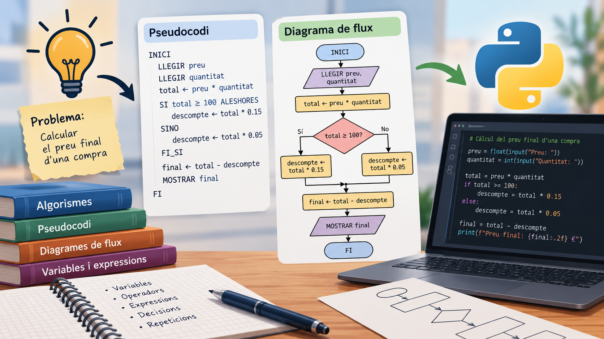

# Fonaments de la Programació

{: .text-center }

---

Programar consisteix, abans que res, a **aprendre a resoldre problemes de manera ordenada**. Abans d'escriure codi en un llenguatge de programació, hem de ser capaços de definir amb claredat els passos que permeten arribar a una solució.

## Algorismes

Un **algorisme** és un conjunt ordenat d'instruccions que permet resoldre un problema o realitzar una tasca.

Perquè un conjunt d'instruccions puga considerar-se un algorisme, ha de complir unes característiques bàsiques:

- **Finit:** ha d'acabar després d'un nombre determinat de passos.
- **Precís:** cada instrucció ha d'estar definida de manera clara i sense ambigüitats.
- **Ordenat:** els passos s'han d'executar seguint una seqüència determinada.
- **Definit:** davant les mateixes dades d'entrada, ha de produir el mateix resultat.
- **Tindre entrades i eixides:** pot rebre dades per poder treballar amb elles i ha de proporcionar algun resultat.

En la introducció al mòdul ja hem treballat el concepte d'algorisme. Ara aprendrem a **representar aquests algorismes** abans de convertir-los en programes escrits en Python.

## Continguts de la Unitat

Començarem utilitzant dues eines fonamentals per dissenyar la solució d'un problema:

- **Pseudocodi:** permet escriure els passos d'un algorisme utilitzant un llenguatge senzill i estructurat, sense dependre de la sintaxi d'un llenguatge de programació concret.
- **Diagrames de flux:** permeten representar gràficament els passos d'un algorisme i el seu ordre d'execució.

A partir d'ací treballarem també els elements necessaris per construir algorismes cada vegada més complets:

- Variables i constants.
- Tipus de dades bàsics.
- Expressions aritmètiques.
- Operadors aritmètics.
- Operadors relacionals.
- Operadors lògics.
- Prioritat dels operadors.
- Algorismes seqüencials.
- Presa de decisions.
- Repetició d'instruccions.

L'objectiu d'aquest primer bloc és aprendre a **analitzar un problema, plantejar-ne la solució i representar-la correctament**. Una vegada dominem aquest procés, en el següent bloc començarem a transformar els nostres algorismes en **programes reals escrits en Python**.

{:toc}