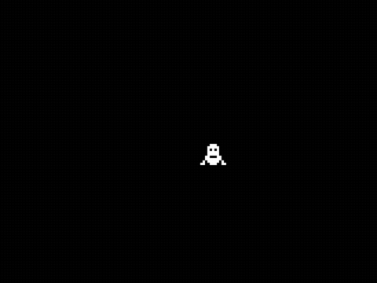
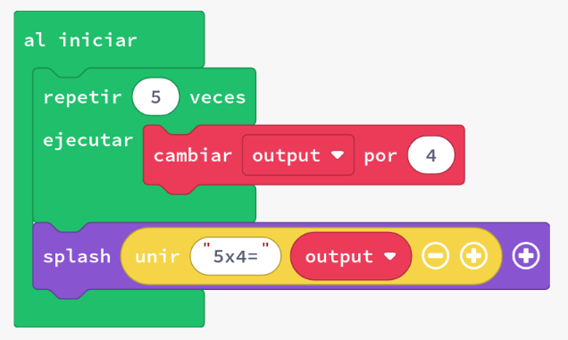
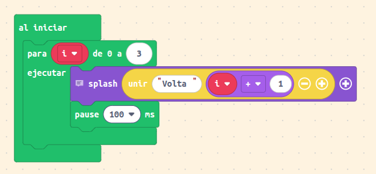
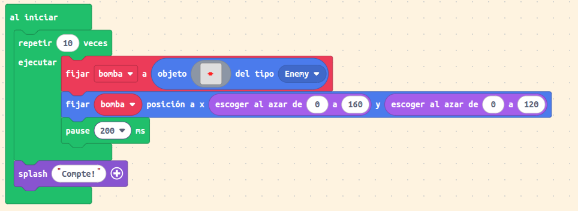
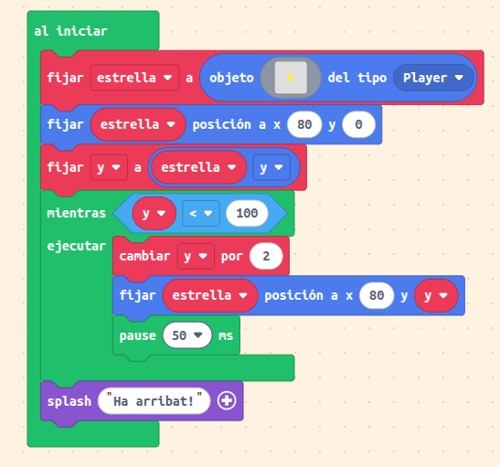
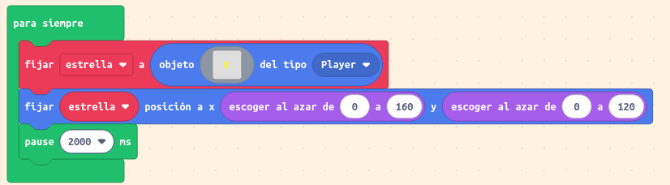

# Introducció als bucles

Quan escrivim codi, sovint volem repetir la mateixa acció. Utilitzant bucles, podem reduir la redundància en el nostre codi, és a dir, podem evitar escriure el mateix codi diverses vegades.

Un exemple de visualització d'un bucle és mirar la multiplicació d'enters com una addició repetida. L'addició repetida de l'enter 4 afegida cinc vegades:

4 + 4 + 4 + 4 + 4 és igual a 4*5

Hem reduït la redundància en l'expressió

4 + 4 + 4 + 4 + 4

utilitzant un operador diferent (multiplicació: *) per expressar la mateixa expressió global.

Podem utilitzar bucles per resoldre tasques d'una manera similar. El següent codi deixa la variable _output_ amb el mateix resultat que les expressions anteriors.

---

# Bucles en MakeCode Arcade

Els **bucles** ens permeten **repetir una acció moltes vegades** sense haver d’escriure el mateix codi una i altra vegada.
Són una eina fonamental per a **automatitzar tasques** dins del nostre videojoc: moure objectes, comptar punts, generar enemics o repetir accions fins que es complisca una condició.

---

## Tipus de bucles

En MakeCode Arcade tenim principalment **tres tipus de bucles**:

1. **Bucle “forever” (per sempre)**
2. **Bucle “repeat N times” (repetix N vegades)**
3. **Bucle “while” (mentres)**

---

### 1. Bucle "forever"

El bloc **“forever”** executa el seu contingut **de manera contínua** mentre el joc està funcionant.
És com dir: *fes això tot el temps, una vegada i una altra.*

* **Exemple:**

Suposem que volem que un personatge es moga a la dreta sense parar.

* **Codi:**

* **Al codi anterior:**
  El bucle `forever` repeteix el bloc intern contínuament. En este cas, incrementa la posició **X** del personatge (`mySprite`), fent que es moga cap a la dreta sense parar.
  Els bucles `forever` **no tenen fi**, per això s’han d’utilitzar per a accions que han d’ocórrer durant tot el joc (com moviments o col·lisions).

---

### 2. Bucle "repeat N times"

El bloc **“repeat X times”** executa el seu contingut **un nombre determinat de vegades**.
És molt útil quan sabem exactament quantes voltes volem repetir una acció.

* **Exemple:**

Volem crear 5 estrelles en diferents llocs de la pantalla.

* **Codi :**

* **Al codi anterior:**
  El bucle `for` en JavaScript equival al bloc `repeat N times` en MakeCode.
  Este codi crea **5 sprites** de tipus *Player* en posicions aleatòries de la pantalla.
  Després de repetir-se 5 voltes, el bucle s’atura automàticament.

---

### 3. Bucle "while" (mentres)

El bloc **“while”** executa el seu contingut **mentres una condició siga certa**.
Quan la condició ja no es complix, el bucle s’atura.

* **Exemple:**

Fem que el jugador perda vida mentre la seua energia siga major que 0.

* **Codi:**

* **Al codi anterior:**
  El bucle comprova si la vida del jugador és major que 0.
  Mentres ho siga, resta 1 punt de vida cada mig segon (`pause(500)`).
  Quan la vida arriba a 0, el bucle s’atura i mostra un missatge.
  Si la condició no arriba a canviar, el joc podria quedar-se “penjat”, per això és important que el valor dins de la condició es modifique dins del bucle.

---

## Altres bucles útils

### Bucle "for index from 0 to N"

Encara que no apareix amb este nom en blocs, el podem aconseguir des de la secció de **“Loops”** amb el bloc **“for index from 0 to N”**.
Serveix per a repetir una acció i saber en quina volta del bucle estem.

* **Exemple:**

Fem que el jugador diga els números del 1 al 4.

* **Codi (MakeCode):**

* **Al codi anterior:**
  El bucle comença amb `index = 1` i acaba en `index = 3`.
  En cada volta mostra un missatge amb el número actual.

---

### En resum

| Tipus de bucle            | Repetició            | Quan s’atura              |
| ------------------------- | -------------------- | ------------------------- |
| **forever**               | Infinita             | Quan s’acaba el joc       |
| **repeat N times**        | Fixa                 | Després de N voltes       |
| **while**                 | Depén d’una condició | Quan la condició és falsa |
| **for index from 0 to N** | Fixa, amb comptador  | Després de N+1 voltes     |

---

* Utilitza **“forever”** per a coses que passen tot el temps, com moviments o detecció de col·lisions.
* Utilitza **“repeat N times”** per a crear objectes o fer accions limitades.
* Utilitza **“while”** només si entens bé la condició i saps que algun dia serà falsa.
* Recorda afegir **“pause()”** dins dels bucles si vols donar temps entre accions, especialment en bucles que repetixen moltes vegades seguides.

---

## Exemples

### Exemple 1 — Bucle `repeat`

Fer que apareguen 10 bombes en diferents llocs i que després el joc mostre “Compte!”

**Blocs:**

### Resultat:

* El bucle crea 10 bombes amb un xicotet retard.
* Quan acaba, mostra un missatge d’alerta.

---

## Exemple 2 — Bucle `while`

### Objectiu:

Fer que una estrella es desplace cap avall fins arribar a la posició y = 100.

**Blocs:**

### Resultat:

* L’estrella comença a la part superior.
* Es mou cap avall fins arribar a y = 100. (la x es manté constant a 80)
* Quan acaba, mostra un missatge.

---

## Exemple 3 — Bucle `forever`

### Objectiu:

Fer que aparega una estrella nova cada 2 segons en una posició aleatòria.

**Blocs:**

### Resultat:

* Es crea una estrella nova cada 2 segons.
* Les estrelles es queden en pantalla.
* El bucle no s’atura mai.

---

