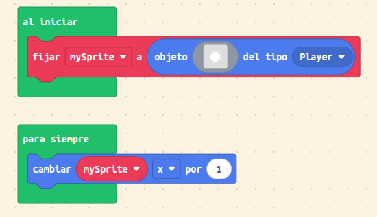
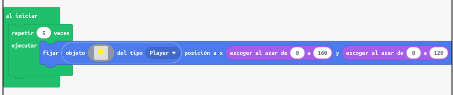
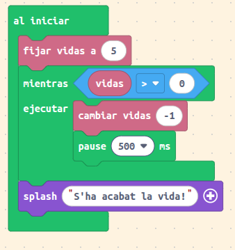
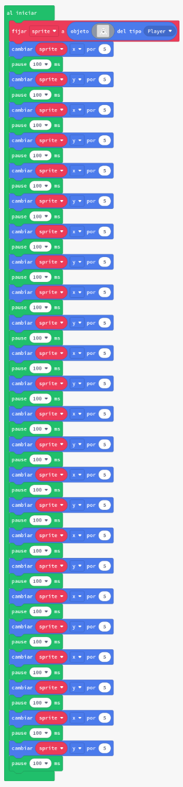
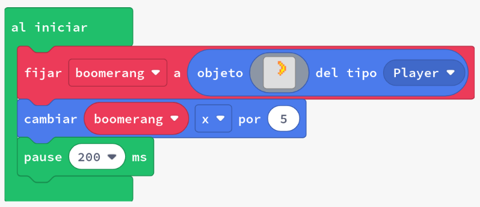

# Introducció als bucles


Quan escrivim codi, sovint volem repetir la mateixa acció. Utilitzant bucles, podem reduir la redundància en el nostre codi, és a dir, podem evitar escriure el mateix codi diverses vegades.

Un exemple de visualització d'un bucle és mirar la multiplicació d'enters com una addició repetida. L'addició repetida de l'enter 4 afegida cinc vegades:

4 + 4 + 4 + 4 + 4 és igual a 4*5


Hem reduït la redundància en l'expressió

4 + 4 + 4 + 4 + 4

utilitzant un operador diferent (multiplicació: *) per expressar la mateixa expressió global.

Podem utilitzar bucles per resoldre tasques d'una manera similar. El següent codi deixa la variable _output_ amb el mateix resultat que les expressions anteriors.


---

# Bucles en MakeCode Arcade

Els **bucles** ens permeten **repetir una acció moltes vegades** sense haver d’escriure el mateix codi una i altra vegada.
Són una eina fonamental per a **automatitzar tasques** dins del nostre videojoc: moure objectes, comptar punts, generar enemics o repetir accions fins que es complisca una condició.

---

## Tipus de bucles

En MakeCode Arcade tenim principalment **tres tipus de bucles**:

1. **Bucle “forever” (per sempre)**
2. **Bucle “repeat N times” (repetix N vegades)**
3. **Bucle “while” (mentres)**

---

### 1. Bucle "forever"

El bloc **“forever”** executa el seu contingut **de manera contínua** mentre el joc està funcionant.
És com dir: *fes això tot el temps, una vegada i una altra.*

* **Exemple:**

Suposem que volem que un personatge es moga a la dreta sense parar.

* **Codi (MakeCode JavaScript):**



* **Al codi anterior:**
  El bucle `forever` repeteix el bloc intern contínuament. En este cas, incrementa la posició **X** del personatge (`mySprite`), fent que es moga cap a la dreta sense parar.
  Els bucles `forever` **no tenen fi**, per això s’han d’utilitzar per a accions que han d’ocórrer durant tot el joc (com moviments o col·lisions).

---

### 2. Bucle "repeat N times"

El bloc **“repeat X times”** executa el seu contingut **un nombre determinat de vegades**.
És molt útil quan sabem exactament quantes voltes volem repetir una acció.

* **Exemple:**

Volem crear 5 estrelles en diferents llocs de la pantalla.

* **Codi :**




* **Al codi anterior:**
  El bucle `for` en JavaScript equival al bloc `repeat N times` en MakeCode.
  Este codi crea **5 sprites** de tipus *Player* en posicions aleatòries de la pantalla.
  Després de repetir-se 5 voltes, el bucle s’atura automàticament.

---

### 3. Bucle "while" (mentres)

El bloc **“while”** executa el seu contingut **mentres una condició siga certa**.
Quan la condició ja no es complix, el bucle s’atura.

* **Exemple:**

Fem que el jugador perda vida mentre la seua energia siga major que 0.

* **Codi (MakeCode):**



* **Al codi anterior:**
  El bucle comprova si la vida del jugador és major que 0.
  Mentres ho siga, resta 1 punt de vida cada mig segon (`pause(500)`).
  Quan la vida arriba a 0, el bucle s’atura i mostra un missatge.
  Si la condició no arriba a canviar, el joc podria quedar-se “penjat”, per això és important que el valor dins de la condició es modifique dins del bucle.

---

## Altres bucles útils

### Bucle "for index from 0 to N"

Encara que no apareix amb este nom en blocs, el podem aconseguir des de la secció de **“Loops”** amb el bloc **“for index from 0 to N”**.
Serveix per a repetir una acció i saber en quina volta del bucle estem.

* **Exemple:**

Fem que el jugador diga els números del 1 al 3.

* **Codi (MakeCode):**


* **Al codi anterior:**
  El bucle comença amb `index = 1` i acaba en `index = 3`.
  En cada volta mostra un missatge amb el número actual.

---

### En resum

| Tipus de bucle            | Repetició            | Quan s’atura              |
| ------------------------- | -------------------- | ------------------------- |
| **forever**               | Infinita             | Quan s’acaba el joc       |
| **repeat N times**        | Fixa                 | Després de N voltes       |
| **while**                 | Depén d’una condició | Quan la condició és falsa |
| **for index from 0 to N** | Fixa, amb comptador  | Després de N+1 voltes     |

---

## Consells pràctics

* Utilitza **“forever”** per a coses que passen tot el temps, com moviments o detecció de col·lisions.
* Utilitza **“repeat N times”** per a crear objectes o fer accions limitades.
* Utilitza **“while”** només si entens bé la condició i saps que algun dia serà falsa.
* Recorda afegir **“pause()”** dins dels bucles si vols donar temps entre accions, especialment en bucles que repetixen moltes vegades seguides.

---


## Exercici pràctic

### Objectiu:

Fer que apareguen 10 bombes en diferents llocs i que després el joc mostre “Compte!”

**Blocs:**

```
repeat 10 times
    create sprite of kind Enemy at (Math.randomRange(0, 160), Math.randomRange(0, 120))
    pause(200)
game.splash("Compte!")
```

### Resultat:

* El bucle crea 10 bombes amb un xicotet retard.
* Quan acaba, mostra un missatge d’alerta.

---

Vols que et prepare també una **versió imprimible** d’estos apunts amb les imatges reals dels blocs de MakeCode Arcade (per a utilitzar en classe o penjar al Moodle)? Puc generar-la amb els blocs exactes i explicacions breus per a cada un.


En aquesta activitat els alumnes seran introduïts a:

- Moviment d'_sprites_ amb bucles
- Bucle `repeat`

## Concepte: Moviment d'_sprites_ amb bucles

Comencem per intentar resoldre una tasca petita: moure un fantasma des del centre de la pantalla cap a altres posicions. 

### Tasca 1: Moure el fantasma



1. Crea un nou projecte a Arcade.
2. Copia el codi de l’exemple a l’editor de MakeCode Arcade i executa’l.
3. Observa com el fantasma es mou cap avall i a la dreta de la pantalla.
4. Fes que l'_sprite_ es mogui cap amunt i a l'esquerra en lloc de cap avall i a la dreta - per fer-ho, canvia tots els moviments perquè siguin en la direcció contrària.
5. Canvia la pausa entre cada pas perquè sigui només de 50 ms, en lloc de 100 - hem decidit que volem que el fantasma sigui una mica més ràpid del que era.

## Concepte: Agrega un nou _sprite_ amb un bucle

Fent la tasca anterior, probablement has notat que estaves fent la mateixa acció repetidament - moure't en una direcció, fer una pausa, moure't en una altra, fer una pausa, i després repetir-ho. En lloc de fer-ho inserint el mateix tros de codi diverses vegades, podem, utilitzant bucles, repetir aquest tros de codi més fàcilment.

### Tasca 2: Agrega un segon _sprite_ amb un bucle

Volem ara afegir un segon fantasma que es mogui cap avall i a la dreta com en l'exemple anterior.

1. Afegeix un segon _sprite_
2. Fes que el segon _sprite_ es mogui en la direcció contrària de l'_sprite_ actual, amb cada pas immediatament després de l'_sprite_ actual

{: .nota }
> El cos del bucle és el codi que està envoltat pel bucle. Hem d'afegir més cos al bucle. <br>
> Comença amb el codi de l'exemple. La solució no és molt diferent de l'exemple - només hem d'afegir el codi per al segon _sprite_ al cos del mateix bucle.

### Tasca 3: Bumerang
    


1. Crea un nou projecte a Arcade.
2. Copia el codi de l’exemple a l’editor de MakeCode Arcade i executa’l.
3. Agrega un sol bucle codi anterior perquè el bumerang vagi cap a la dreta 50 píxels durant dos segons.
4. **Repte:** Utilitza el bloc `girar imatge horitzontalment` dins dels bucles per fer que sembli que el bumerang està girant mentre es mou.

{: .nota }
> El moviment i els reflexos horitzontals es produiran molt ràpidament a menys que incloguis la pausa al bucle.

## Avaluació

Crea un document i respon a les següents qüestions:

- Descriu com un bloc de repetició fa que la programació sigui més fàcil reduint la repetició del codi. Utilitza un exemple.
- Explica com és més fàcil (o més difícil) afegir un segon _sprite_ al codi dins del bucle que hauria estat afegir-lo a la versió anterior (sense bucle)? Per què?
- Has utilitzat més d'un bucle en qualsevol de les tasques anteriors? Per què podries voler tenir un bucle després de l'altre, en lloc de simplement combinar-los en un sol bucle? 

**Penja el document a l'aula virtual (tasca 1.2.1).**
