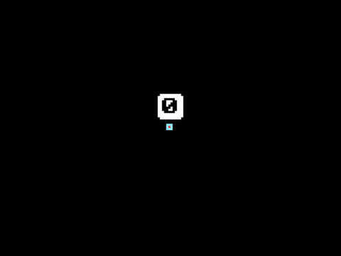
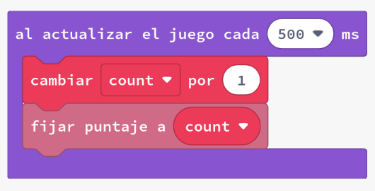
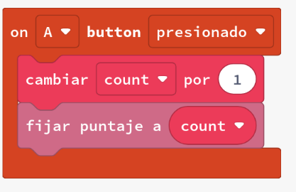
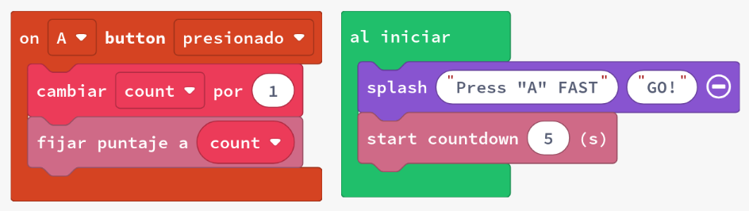

# Bucles d'increment

Els jocs sovint necessiten mantenir diverses variables per fer un seguiment de com ho està fent un jugador. Quan programem en blocs, hi ha moltes maneres en què el codi del joc necessita augmentar (o disminuir) un comptador.

Ens referim a augmentar un comptador com a incrementar-lo, i disminuir el comptador com a disminuir-lo. Actualitzarem la puntuació del nostre joc utilitzant el bloc de canvi.

En aquestes activitats veurem:

- bucles de repetició
- bucles per índex
- Variables amb `cambiar`
- `en actualització de joc cada`
- Gestió de la puntuació i comptes enrere

## Concepte: Incrementem una variable

Quan juguem a un joc, sovint volem mantenir un seguiment de la puntuació. Per fer-ho, necessitem una variable que pugui augmentar cada vegada que fem alguna cosa que ens doni punts. Per exemple, si el jugador aconsegueix un objectiu, la puntuació pot augmentar en 10 punts.

### Exemples: Incrementar una variable

1. Crea un nou projecte a Arcade.
2. Copia cadascun dels exemples següents i posa'ls en marxa.
   - **#1a** Actualitzant el valor cada 500ms:
     
   - **#1b** Actualitzant el valor quan es prem un botó:
     
   - **#1c** Actualitzant el valor en un comptador enrere:
     
3. Avalua com funciona cada exemple.
4. Modifica el valor de `por` en `cambiar count` i observa com canvia el comportament del joc.

### Tasca 1: Fem que el joc tinga un entrenador que ens anime

1. Comença amb el codi de l'exemple #1c
2. Afegeix un sprite que faça d'entrenador i motive el jugador
3. Utilitza `decir` per motivar al jugador, establint un temps d'exhibició curt (per exemple, 500 ms)
4. Fes que `diu` parpellege, posant-lo en `en actualització de joc cada 1000 ms`
5. Repte: fes que l'_sprite_ entrenador doni la puntuació actual a més d'un crit d'ànim ("Més ràpid!")

Perfecte. Ací tens la redacció de la **tasca** al teu estil, clara i progressiva, amb indicació d’on va el codi però sense mostrar-lo directament:

---

### Tasca 2: Increment i decrement amb els botons A i B

1. Crea un nou projecte a **MakeCode Arcade**.
2. Afig un sprite senzill i col·loca’l al centre de la pantalla.
3. Declara una variable anomenada `increment` i posa-li valor inicial **0**.
4. Mostra el valor de `increment` com a marcador de puntuació per veure com canvia.
5. Fes que quan el jugador prema el botó **A**, el valor de `increment` augmente en **5**.
6. Fes que quan el jugador prema el botó **B**, el valor de `increment` disminuïsca en **5**.
7. Crea una actualització periòdica del joc que s’execute cada **100 mil·lisegons** i faça que l’sprite es moga en horitzontal segons el valor actual d’`increment`.
8. Activa l’opció **StayInScreen** per a evitar que l’sprite isca de la pantalla.

El resultat hauria de ser un sprite que es desplaça a la dreta o a l’esquerra segons el valor d’`increment`, fent-lo més ràpid o més lent cada vegada que premes els botons **A** o **B**.

